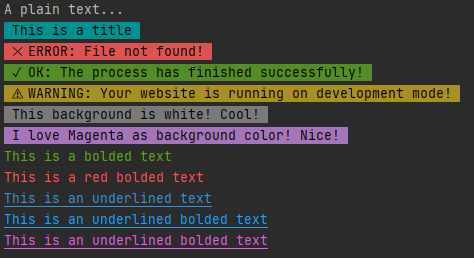
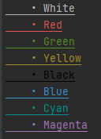
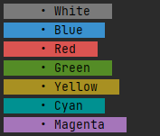

# **RGB Console for Node.js Server**

Author: Matan Aviav.<br />
E-mail: matanaviav.npmjs@gmail.com<br />
Style your **Node.js Server** console (terminal) with text colors, background colors and symbols.
<br /><br />
Example (Terminal of WebStorm):<br />
>

And the code for the above output:
```
const cc = require('rgb-console');

cc.log('A plain text...')
cc.title('This is a title')
cc.error('File not found!')
cc.ok('The process has finished successfully!');
cc.warn('Your website is running on development mode!');
cc.whiteBG('This background is white! Cool!')
cc.bg('I love Magenta as background color! Nice!', cc.BG_COLORS.MAGENTA)
cc.bold('This is a bolded text', cc.TEXT_COLORS.GREEN);
cc.redBold('This is a red bolded text');
cc.underlineBlue("This is an underlined text")
cc.underlineBlue("This is an underlined bolded text", true)
cc.underline("This is an underlined bolded text", cc.TEXT_COLORS.MAGENTA, true)
```


## How to use?<br />
### 1. Install the module:
First, install the module in your project folder with the following command:
```
npm install rgb-console
```
<br />

### 2. Import the module:
First, import the module into a variable with `require()` function:
```
const cc = require('rgb-console')
```
<br />

### 3. Use it:
Use the different functions the variable has. Examples:
```
const cc = require('rgb-console');

cc.log('A plain text...')
cc.title('This is a title')
cc.error('File not found!')
cc.ok('The process has finished successfully!');
cc.warn('Your website is running on development mode!');
cc.whiteBG('This background is white! Cool!')
cc.bg('I love Magenta as background color! Nice!', cc.BG_COLORS.MAGENTA)
cc.bold('This is a bolded text', cc.TEXT_COLORS.GREEN);
cc.redBold('This is a red bolded text');
```

<br />


## Documentation:

### 1. Plain Text (no style):
For plain text use `log(...)` function.<br />
`RGBConsole.log()` function is the same function as `console.log(...)` of JavaScript.
<br /><br />

### 2. Title Style:
You can use `title(...)` function for a bold title.<br />
The `title(...)` function will output a message which has:
```
    (-) A Cyan Background Color
    (-) A Black Text Color
```

Example:
```
const cc = require('rgb-console');
cc.title('This is a title');
```
Output:
>


<br /><br />

### 3. Colored Text:
Note: you can run `RGBConsole run text examples` for a quick tutorial.<br />
For colored text use functions with `text` prefix.<br />
For example, calling `textBlue('Some Text')` will output:
>

The functions for colored text are:
```
textWhite("Some Text")
textRed("Some Text")
textGreen("Some Text")
textYellow("Some Text")
textBlack("Some Text")
textBlue("Some Text")
textCyan("Some Text")
textMagenta("Some Text")
```

You can also use shorthand functions:
```
white("Some Text")
red("Some Text")
green("Some Text")
yellow("Some Text")
black("Some Text")
blue("Some Text")
cyan("Some Text")
magenta("Some Text")
```

Preview of the colors:<br />
>

<br />
<br />

### 4. Colored Bolded Text:
Note: you can run `RGBConsole run bold examples` for a quick tutorial.<br />
For colored bolded text use functions with `bold` prefix.<br />
For example, calling `boldMagenta('Some Text')` will output:
>

The functions for colored bolded text are:
```
boldWhite("Some Text")
boldRed("Some Text")
boldGreen("Some Text")
boldYellow("Some Text")
boldBlack("Some Text")
boldBlue("Some Text")
boldCyan("Some Text")
boldMagenta("Some Text")
```

You can also use the same functions but with `color name` as prefix and `Bold` as suffix:
```
whiteBold("Some Text")
redBold("Some Text")
greenBold("Some Text")
yellowBold("Some Text")
blackBold("Some Text")
blueBold("Some Text")
cyanBold("Some Text")
magentaBold("Some Text")
```

You can also use `bold(...)` function directly with the following parameters:
```
    (1) text: string - A Text
    (2) text_color: string - A Text Color from RGBConsole.TEXT_COLORS object:
        BLACK
        BLUE
        CYAN
        GREEN
        MAGENTA
        RED
        WHITE
        YELLOW
```

Example:
```
const cc = require('rgb-console');
cc.bold('Some Text', cc.TEXT_COLORS.MAGENTA);
```
Output:<br />
>

Preview of the bolded text colors:<br />
>

<br />
<br />


### 5. Colored Underlined Text:
Note: you can run `RGBConsole run underline examples` for a quick tutorial.<br />
For colored underlined text use functions with `underline` prefix.<br />
For example, calling `underlineYellow('Some Text')` will output:
>

All functions for colored underlined text accept the following optional second parameter:
```
isBold?: boolean - Make the text bolded (Optional). Default: false
```

The functions for colored underlined text are:
```
underlineWhite("Some Text")
underlineRed("Some Text")
underlineGreen("Some Text")
underlineYellow("Some Text")
underlineBlack("Some Text")
underlineBlue("Some Text")
underlineCyan("Some Text")
underlineMagenta("Some Text")
```

You can also use the same functions but with `color name` as prefix and `Underline` as suffix:
```
whiteUnderline("Some Text")
redUnderline("Some Text")
greenUnderline("Some Text")
yellowUnderline("Some Text")
blackUnderline("Some Text")
blueUnderlined("Some Text")
cyanUnderline("Some Text")
magentaUnderline("Some Text")
```

Example:
```
const cc = require('rgb-console');
cc.underlineGreen('Some Text');
cc.blueUnderline('Some Text', true);
```
Output:<br />
>

<br />

You can also use `underline(...)` function directly with the following parameters:
```
    (1) text: string - A Text
    (2) text_color: string - A Text Color from RGBConsole.TEXT_COLORS object:
        BLACK
        BLUE
        CYAN
        GREEN
        MAGENTA
        RED
        WHITE
        YELLOW
    (3) isBold?: boolean - Make the text bolded (Optional). Default: false
```

Example:
```
const cc = require('rgb-console');
cc.underline('Some Text', cc.TEXT_COLORS.MAGENTA);
```
Output:<br />
>

Preview of the underlined text colors:<br />
>

<br />
<br />


### 6. Colored Background:
Note: you can run `RGBConsole run background examples` for a quick tutorial.<br />
For colored background use functions with `BG` prefix.<br />
For example, calling `BGRed('Some Text')` will output:
>

The functions for colored background are:
```
BGWhite("Some Text")
BGBlue("Some Text")
BGRed("Some Text")
BGGreen("Some Text")
BGYellow("Some Text")
BGCyan("Some Text")
BGMagenta("Some Text")
```

You can also use the same functions but with `color name` as prefix and `BG` as suffix:
```
whiteBG("Some Text")
blueBG("Some Text")
redBG("Some Text")
greenBG("Some Text")
yellowBG("Some Text")
cyanBG("Some Text")
magentaBG("Some Text")
```

You can also use `bg(...)` function directly with the following parameters:
```
    (1) text: string - A Text
    (2) bg_color: string - A Background Color from RGBConsole.BG_COLORS object:
        WHITE
        BLUE
        RED
        GREEN
        YELLOW
        CYAN
        MAGENTA
    (3) text_color?: string - A text color from RGBConsole.TEXT_COLORS object (Optional). Default text color: BLACK
```

Example:
```
const cc = require('rgb-console');
cc.bg('Some Text', cc.BG_COLORS.CYAN);
```
Output:<br />
>

Preview of the colors:<br />
>

<br />
<br />

### 7. Error/Negative Messages:
Note: you can run `RGBConsole run error examples` for a quick tutorial.<br />
For Error/Negative messages use `error(...)`, `bad(...)` or `fail(...)` functions.<br />
For example, calling `error('Some Text')` will output:
>

By default, `error(...)` function will output a message which has:
```
    (-) A Red Background Color
    (-) A X symbol at the beginning
    (-) The word 'ERROR' as prefix
```

Note that `error(...)` function does accept the following parameters:
```
    (1) text: string - A Text
    (2) options?: object (Optional) - An object with the following properties:
        (a) removeSymbol?: boolean - Remove the X symbol from the beginning (Optional)
        (b) newPrefix?: string - A new prefix at the beginning (Optional)
```
<br />

#### Examples:
1. Calling `error("Some Text", {removeSymbol: true})` will output:
>

2. Calling `error("Some Text", {removeSymbol: true, newPrefix: "CustomPrefix"})` will output:
>

3. Calling `error("Some Text", {removeSymbol: true, newPrefix: ""})` will output:
>

4. Calling `error("Some Text")` will output:
>


<br />

#### The `bad(...)` and `fail(...)` Functions:
The `bad(...)` and `fail(...)` functions are the same as `error(...)` function but with one difference:

```
    (-) By default, bad(...) function has the word 'BAD' as prefix
    (-) By default, fail(...) function has the word 'FAIL' as prefix
```

<br />
<br />

### 8. Success/Positive Messages:
Note: you can run `RGBConsole run ok examples` for a quick tutorial.<br />
For Success/Positive messages use `ok(...)`, `success(...)` or `good(...)` functions.<br />
For example, calling `ok('Some Text')` will output:
>

By default,  `ok(...)` function will output a message which has:
```
    (-) A Green Background Color
    (-) A check symbol at the beginning
    (-) The word 'OK' as prefix
```

Note that `ok(...)` function does accept the following parameters:
```
    (1) text: string - A Text
    (2) options?: object (Optional) - An object with the following properties:
        (a) removeSymbol?: boolean - Remove the check symbol from the beginning (Optional)
        (b) newPrefix?: string - A new prefix at the beginning (Optional)
```
<br />

#### Examples:
1. Calling `ok("Some Text", {removeSymbol: true})` will output:
>

2. Calling `ok("Some Text", {removeSymbol: true, newPrefix: "CustomPrefix"})` will output:
>

3. Calling `ok("Some Text", {removeSymbol: true, newPrefix: ""})` will output:
>

4. Calling `ok("Some Text")` will output:
>


<br />

#### The `success(...)` and `good(...)` Functions:
The `success(...)` and `good(...)` functions are the same as `ok(...)` function but with one difference:

```
    (-) By default, success(...) function has the word 'SUCCESS' as prefix
    (-) By default, good(...) function has the word 'GOOD' as prefix
```

<br />
<br />

### 9. Warning Messages:
Note: you can run `RGBConsole run warn examples` for a quick tutorial.<br />
For Warning messages use `warn(...)` function.<br />
For example, calling `warn('Some Text')` will output:
>

By default, `warn(...)` function will output a message which has:
```
    (-) A Yellow Background Color
    (-) A Warning symbol at the beginning
    (-) The word 'WARNING' as prefix
```

Note that `warn(...)` function does accept the following parameters:
```
    (1) text: string - A Text
    (2) options?: object (Optional) - An object with the following properties:
        (a) removeSymbol?: boolean - Remove the Warning symbol from the beginning (Optional)
        (b) newPrefix?: string - A new prefix at the beginning (Optional)
```
<br />

#### Examples:
1. Calling `warn("Some Text", {removeSymbol: true})` will output:
>

2. Calling `warn("Some Text", {removeSymbol: true, newPrefix: "CustomPrefix"})` will output:
>

3. Calling `warn("Some Text", {removeSymbol: true, newPrefix: ""})` will output:
>

4. Calling `warn("Some Text")` will output:
>


<br />
<br />
<br />


